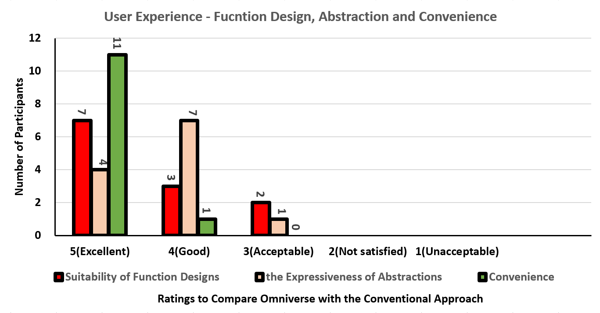

# Omniverse-OpenDS
## Introduction
Omniverse-OpenDS is a a set of configurable abstractions for efficient developments of complex driving events in OpenDS. 
Full paper is accepted by HCII'22 and the preprint version is accessible at [here](https://www.researchgate.net/publication/358532661_Omniverse-OpenDS_Enabling_Agile_Developments_for_Complex_Driving_Scenarios_via_Reconfigurable_Abstractions).
## Motivation
Omniverse aims to address and takes the first attempt to solve the following issue and challenges:

Issue: how to efficiently construct a complicated scenario for in-lab driver simulations?

Challenge 1: The requirement of a large amount of prerequisite of detailed OpenDS designs and implementations before developing driving scenarios in OpenDS.

Challenge 2: The workloads of building these driving events are often large and significant, with the growing complexity of corresponding scenarios.

Challenge 3: The lack of relevant abstractions lead to poor organization and constructions of implementations

## Design
The design principle of Omniverse is to maximize the reuse of abstracted models as much as possible, so the implementations of hands-tuned parameters can be as few as possible, which substantially reduce the overall development burdens, and the there are two main components in Omniverse: Abstraction Design and Automatic Filling.

Abstraction Design: There are mathematical relationships between many parameters within a driving scenario, which can be abstracted and reused for different driving events by exploiting some common parameters. As a result, we can accurately implement driving events in a correct manner by automatically generating these parameters by exploiting these relationships via abstracted models.

Automatic Filling: This part is designed to automatically generate waypoints based on the result from the Abstraction model.

## Implementation Details

Omniverse is implemented in JAVA (the same language as OpenDS) and it is implemented as an external library, each abstracted model is individually encapsulated as a method. 

## Experiment Result
We performed an empirical study which involves 12 volunteers to examine the effectiveness of Omniverse and the result as follows:

a) The following figure reports the results in terms of the improved efficiency when using Omniverse and it shows Omniverse can save 42.7% development time, averaged across all participants.

b) The following figure reports the results on user experience when using Omniverse, in terms of the Suitability of Function Designs, the Expressiveness of Abstractions and the Convenience. The result shows Omniverse can greatly improve the overall user experience via significantly improved readability and extend-ability of codes.

## Code Contributor
@[Zilin Song](https://github.com/ZilinSONG), mentored by @[Xiangjun Peng](https://github.com/Shiangjun).